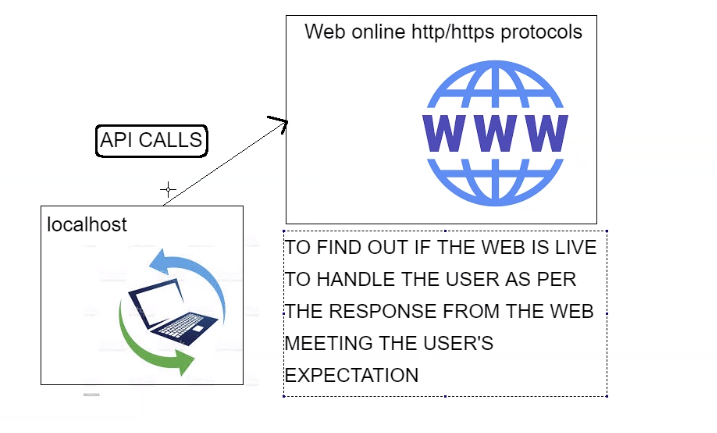

# Python Modules
## Built in Functions & the Python Library
- Built in Functions help us to accelerate the development of our software
- If we're going to reinvent the wheel there should be a very good reason for doing so
-  
### Creating a customised method that utilises built in functions
```
def current_sys_path():
    print("This is your current directory: ")
    return sys.path


print(current_sys_path())
```
## What is pip and how do we use it
- Package manager for Python
- Helps us install external packages
- The package we are installing now is called requests
- Syntax is ```pip install name_of_package```
## APIs with Python
- Application Programming Interfacing
- Collection of packages
- 
## Tasks
### Task 1
- Get user input of a float number
- Check if the number is lower than .50 then round the figure to lower end
- Check if the number is greater than .51 then round the figure to upper end
### Solution
- Getting the users input and storing it in a variable
```
user_float = input("Please input a decimal number and watch as it gets rounded to the nearest integer value!  ")
```
- Finding the decimal place in the number
```
decimal_index = user_float.find(".")
```
- Checking if the decimal parts are 0.50 or over and rounding up if so
```
if int(user_float[decimal_index+1:decimal_index+2]) >= 5:
    print(f"That number was closer to its upper bound, so just like magic: {math.ceil(float(user_float))} ")
```
- Checking if the decimal parts are less than 0.50 and rounding down if so
```
elif int(user_float[decimal_index+1:decimal_index+2]) < 5:
    print(f"That number was closer to its lower bound, so just like magic: {math.floor(float(user_float))} ")
```